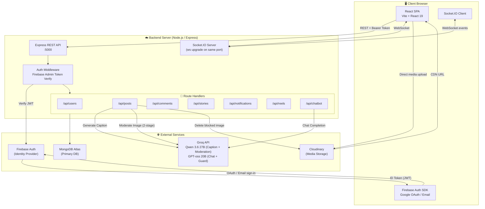
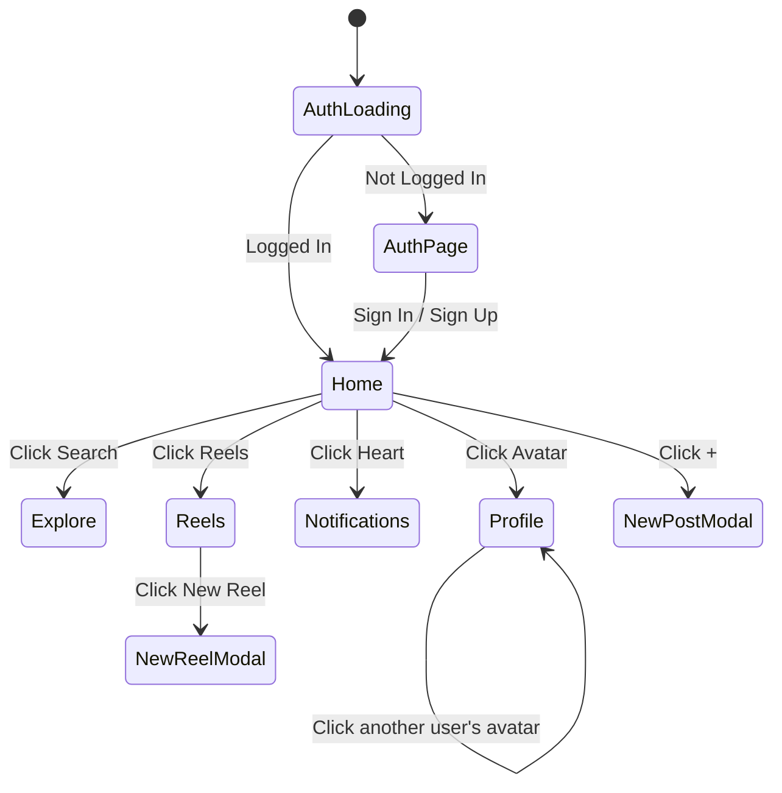
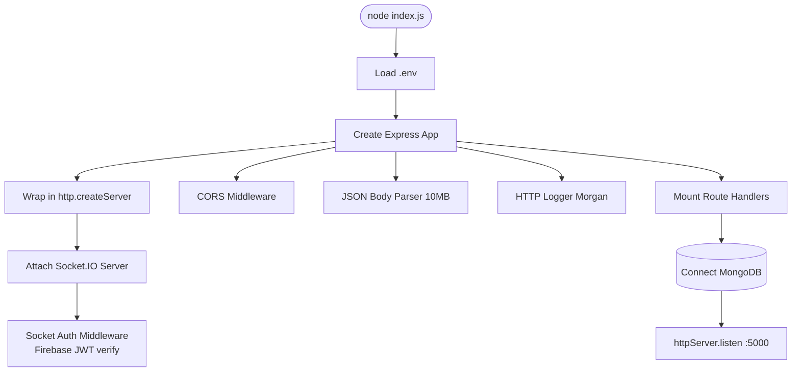
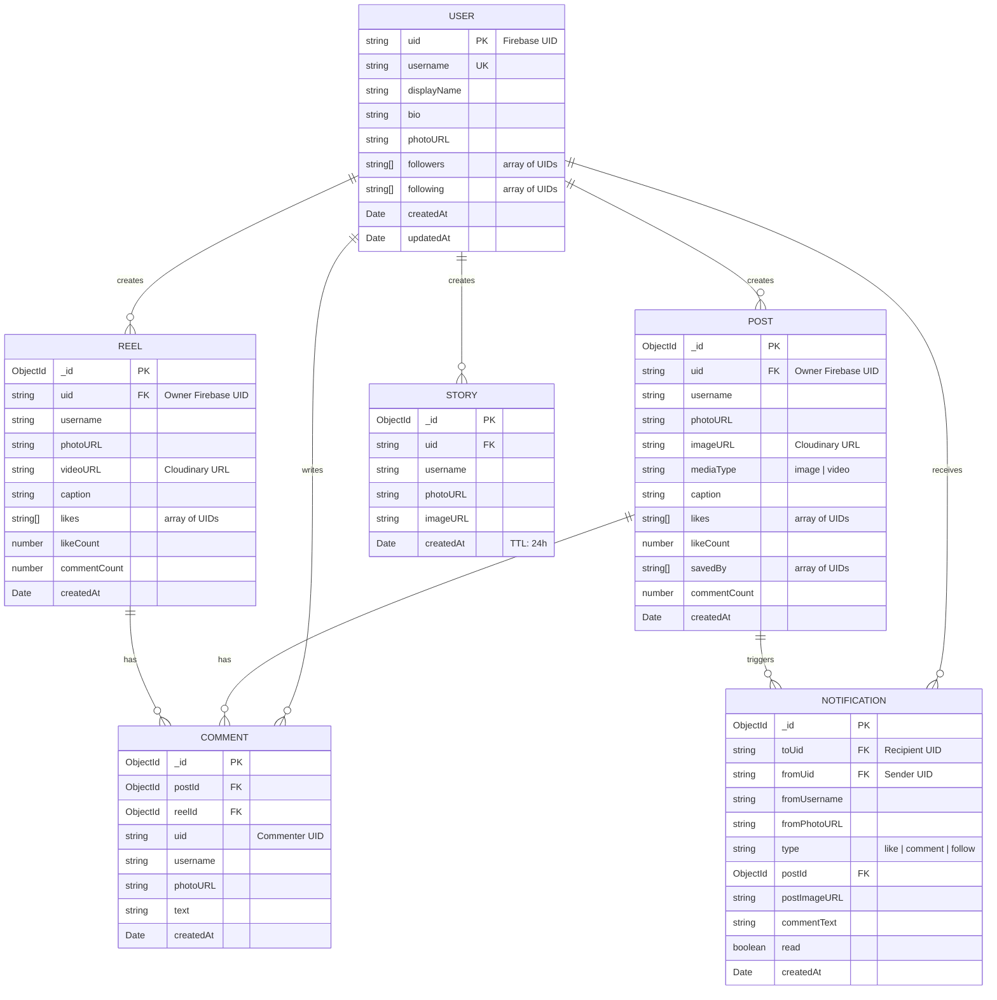
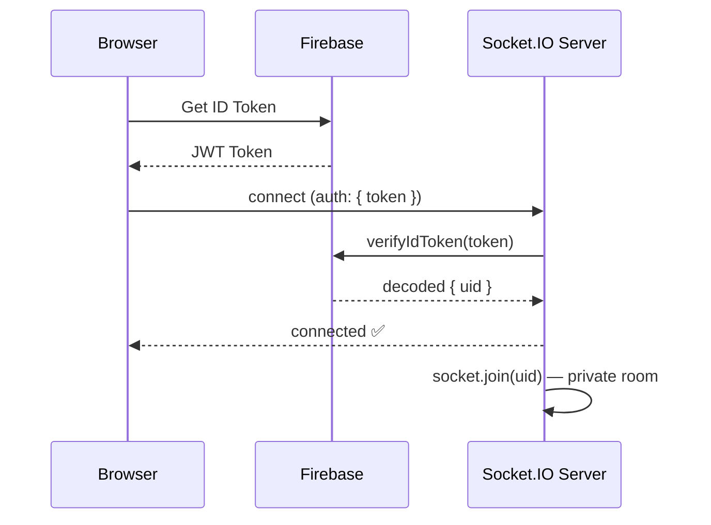
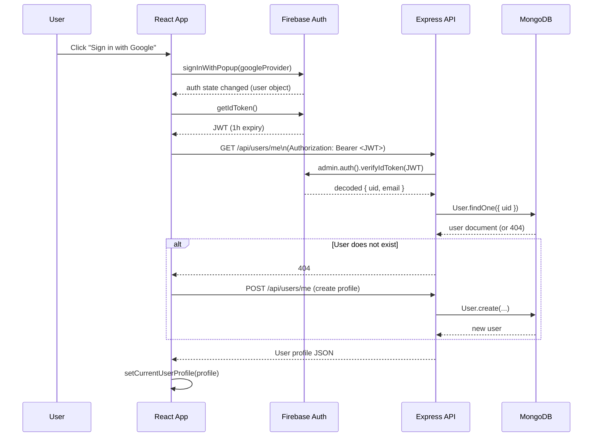
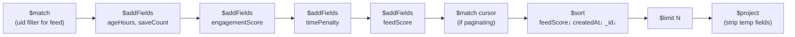
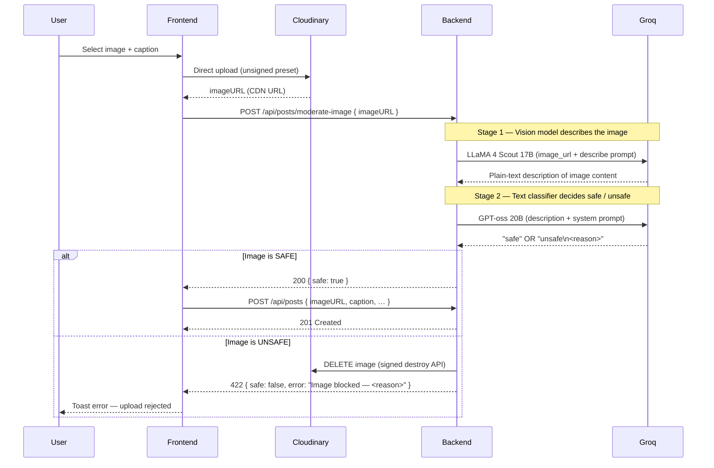
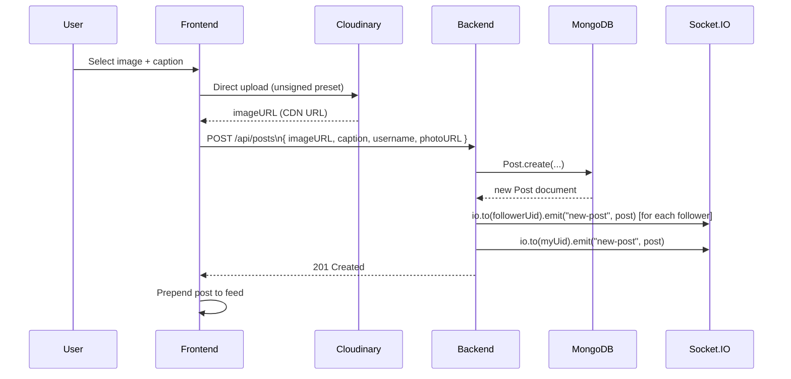
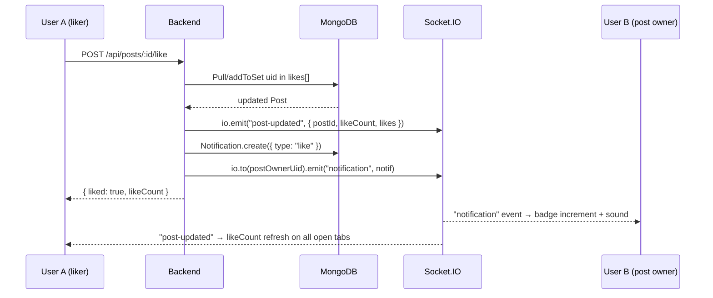

# Snapgram — Architecture Diagram & System Design

---

## 1. High-Level Overview

Snapgram is a **full-stack Instagram-like social media platform** with the following capabilities:

| Feature | Description |
|---|---|
| 📸 Posts | Image & video posts with AI-generated captions |
| 🎞️ Reels | Short-form vertical video feed |
| 📖 Stories | 24-hour expiring image stories |
| 🔔 Notifications | Real-time push notifications (like, comment, follow) |
| 🔍 Explore | Discover trending posts/users |
| 💾 Save | Bookmark posts for later |
| 👥 Follow System | Follow/unfollow users, followers/following lists |
|  AI Captions | Groq LLaMA 4 vision model auto-generates captions |
| 🛡️ Content Moderation | AI two-stage image scan before every post/reel goes live,AI text moderation on every comment |
| 🤖 Snap AI Chatbot | In-app AI assistant powered by Groq GPT-oss 20B |
| 🌙 Dark Mode | Persistent dark/light mode toggle |

---

## 2. Tech Stack

### Frontend
| Layer | Technology |
|---|---|
| Framework | React 19 + Vite 8 |
| Routing | Custom SPA state-based routing (no React Router) |
| Styling | Vanilla CSS (`App.css`) with CSS variables |
| Auth Client | Firebase JS SDK v12 |
| Real-Time | Socket.IO Client v4 |
| Build Tool | Vite |

### Backend
| Layer | Technology |
|---|---|
| Runtime | Node.js |
| Framework | Express.js v4 |
| Database | MongoDB (via Mongoose v8) |
| Auth Server | Firebase Admin SDK v12 |
| Real-Time | Socket.IO v4 |
| AI Integration | Groq SDK (Qwen 3.6 27B + GPT-oss 20B) |
| Media Storage | Cloudinary (via URL — client-side upload) |
| Logging | Morgan |
| Config | dotenv |

---

## 3. System Architecture Diagram



---

## 4. Frontend Architecture

### Page Routing (State-based SPA)
There is **no React Router** — navigation is managed via a `page` state string in `App.jsx`.



### Frontend Directory Structure

```
frontend/src/
├── main.jsx              # React entry point
├── App.jsx               # Root component (auth, routing, layout, sockets)
├── App.css               # Global styles + CSS variables (dark/light themes)
├── index.css             # Base reset styles
├── firebase.js           # Firebase init + auth export
├── api.js                # apiFetch() wrapper (injects Bearer token)
├── socket.js             # Socket.IO client factory (singleton + token refresh)
├── utils.js              # Shared helpers (formatTime, etc.)
├── assets/               # Static assets
├── hooks/
│   └── useCursorPagination.js  # Reusable infinite scroll hook (+ updateItem)
├── components/
│   ├── Avatar.jsx        # User avatar with fallback initials
│   ├── Icons.jsx         # All SVG icon components
│   ├── PostCard.jsx      # Full post card (like, comment, save, delete; double-tap to like)
│   ├── ReelCard.jsx      # Vertical reel card (like, comment, fullscreen)
│   ├── ChatbotCard.jsx   # Snap AI chatbot overlay (Groq GPT-oss 20B)
│   ├── NewPostModal.jsx  # Create post modal (Cloudinary upload + AI caption)
│   ├── NewReelModal.jsx  # Create reel modal (Cloudinary video upload)
│   └── RightPanel.jsx    # Right sidebar (user suggestions, follow)
└── pages/
    ├── AuthPage.jsx       # Sign in / Sign up (Google + Email/Password)
    ├── FeedPage.jsx       # Home feed (ranked posts from followed users)
    ├── ExplorePage.jsx    # Discover all trending posts
    ├── ReelsPage.jsx      # Vertical short video feed
    ├── ProfilePage.jsx    # User profile (posts, reels, followers, edit)
    └── NotificationsPage.jsx  # Like / comment / follow notifications
```

### Key Frontend Patterns

| Pattern | Description |
|---|---|
| **Cursor Pagination** | `useCursorPagination` hook powers infinite scroll on all feeds; `updateItem()` allows in-place patch without refetch |
| **Optimistic UI** | Likes and saves update locally before server confirms |
| **Socket Real-Time** | `getSocket()` singleton connects on login, disconnects on logout; reconnection capped at 10 attempts |
| **Named Socket Handlers** | Event listeners stored as named functions so `sock.off()` cleanup is precise — prevents duplicate/ghost handlers |
| **Token Injection** | `apiFetch()` calls `auth.currentUser.getIdToken()` before every request |
| **Dark Mode** | CSS class `dark` on `<body>`, persisted to `localStorage` |
| **Browser Notifications** | Web Notification API + audio tone on real-time notification events |
| **Snap AI Chatbot** | Floating chat panel backed by `/api/chatbot/chat` — maintains rolling 20-message context window |

---

## 5. Backend Architecture

### Server Entry Point (`index.js`)



### Middleware Pipeline

```
Request
  │
  ▼
CORS (origin whitelist)
  │
  ▼
express.json() — 10MB body limit
  │
  ▼
morgan() — HTTP dev logging
  │
  ▼
Route Handler
  │
  ▼
authenticate() — Firebase JWT verify  ← Applied per-route
  │
  ▼
Business Logic → MongoDB
  │
  ▼
Socket.IO Event Emit (where applicable)
  │
  ▼
Response
```

---

## 6. Data Models

### Entity-Relationship Diagram



### MongoDB Indexes

| Collection | Index | Purpose |
|---|---|---|
| `users` | `uid` (unique) | Fast lookup by Firebase UID |
| `users` | `username` (unique) | Unique username constraint |
| `posts` | `{ uid, createdAt: -1 }` | User's posts, newest first |
| `posts` | `{ likeCount: -1 }` | Trending posts |
| `posts` | `{ createdAt: -1 }` | Chronological feed |
| `reels` | `{ uid, createdAt: -1 }` | User's reels |
| `reels` | `{ likeCount: -1 }` | Trending reels |
| `comments` | `{ postId, createdAt: 1 }` | Post comments |
| `comments` | `{ reelId, createdAt: 1 }` | Reel comments |
| `notifications` | `{ toUid, createdAt: -1 }` | User's inbox |
| `stories` | `{ createdAt: -1 }` + TTL 86400s | Auto-expire after 24h |

---

## 7. API Endpoints

### Users — `/api/users`

| Method | Endpoint | Auth | Description |
|---|---|---|---|
| `GET` | `/me` | ✅ | Get current user profile |
| `POST` | `/me` | ✅ | Create user profile (first login) |
| `PUT` | `/me` | ✅ | Update profile (bio, photo, username) |
| `GET` | `/suggestions` | ✅ | Get follow suggestions (paginated) |
| `GET` | `/search?q=` | ✅ | Search users by username prefix |
| `GET` | `/:uid` | ✅ | Get user by Firebase UID |
| `POST` | `/:uid/follow` | ✅ | Toggle follow/unfollow |
| `GET` | `/:uid/followers` | ✅ | Get followers list (paginated) |
| `GET` | `/:uid/following` | ✅ | Get following list (paginated) |

### Posts — `/api/posts`

| Method | Endpoint | Auth | Description |
|---|---|---|---|
| `GET` | `/feed` | ✅ | Ranked feed from followed users (cursor paginated) |
| `GET` | `/explore` | ✅ | Ranked feed of all posts (cursor paginated) |
| `GET` | `/saved` | ✅ | User's saved/bookmarked posts |
| `GET` | `/user/:uid` | ✅ | Posts by a specific user |
| `POST` | `/` | ✅ | Create a new post |
| `DELETE` | `/:id` | ✅ | Delete a post (owner only) |
| `POST` | `/:id/like` | ✅ | Toggle like on a post |
| `POST` | `/:id/save` | ✅ | Toggle save/bookmark on a post |
| `POST` | `/generate-caption` | ✅ | AI caption from image (Groq LLaMA 4 Scout) |
| `POST` | `/moderate-image` | ✅ | Two-stage AI safety scan; deletes blocked image from Cloudinary; returns 422 if unsafe |

### Comments — `/api/comments`

| Method | Endpoint | Auth | Description |
|---|---|---|---|
| `GET` | `/?postId=` | ✅ | Get comments for a post |
| `GET` | `/?reelId=` | ✅ | Get comments for a reel |
| `POST` | `/` | ✅ | Add a comment (text moderated by AI before saving; returns 422 if blocked) |
| `DELETE` | `/:id` | ✅ | Delete a comment (owner only) |

### Stories — `/api/stories`

| Method | Endpoint | Auth | Description |
|---|---|---|---|
| `GET` | `/` | ✅ | Get active stories from followed users |
| `POST` | `/` | ✅ | Post a new story (auto-expires 24h) |

### Notifications — `/api/notifications`

| Method | Endpoint | Auth | Description |
|---|---|---|---|
| `GET` | `/` | ✅ | Get user's notifications |
| `GET` | `/unread-count` | ✅ | Get count of unread notifications |
| `PUT` | `/mark-read` | ✅ | Mark all as read |

### Reels — `/api/reels`

| Method | Endpoint | Auth | Description |
|---|---|---|---|
| `GET` | `/feed` | ✅ | Ranked global reels feed (cursor paginated) |
| `GET` | `/explore` | ✅ | All reels explore view |
| `GET` | `/user/:uid` | ✅ | Reels by a specific user |
| `POST` | `/` | ✅ | Upload a new reel |
| `POST` | `/:id/like` | ✅ | Toggle like on a reel |
| `DELETE` | `/:id` | ✅ | Delete a reel (owner only) |

### Chatbot — `/api/chatbot`

| Method | Endpoint | Auth | Description |
|---|---|---|---|
| `POST` | `/chat` | ✅ | Send a message to Snap AI; returns AI reply (Groq GPT-oss 20B) |

**Request body:**
```json
{ "messages": [ { "role": "user", "content": "How do I post a reel?" } ] }
```
**Response:**
```json
{ "reply": "To post a reel, tap the + icon and select 'Reel'…" }
```
> The backend keeps the last **20 messages** in context and prepends a platform-aware system prompt (`SYSTEM_PROMPT`) so Snap AI always responds in the context of Snapgram.

---

## 8. Real-Time System (Socket.IO)

### Connection Flow



### Real-Time Events

| Event Name | Direction | Trigger | Payload |
|---|---|---|---|
| `notification` | Server → Client | Like / Comment / Follow | Notification object |
| `new-post` | Server → Client | New post created | Post object |
| `post-updated` | Server → All | Post liked | `{ postId, likeCount, likes }` |
| `post-deleted` | Server → All | Post deleted | `{ postId }` |
| `new-comment` | Server → All | Comment added | `{ postId, commentCount }` |
| `reel-updated` | Server → All | Reel liked | `{ reelId, likeCount, likes }` |
| `reel-deleted` | Server → All | Reel deleted | `{ reelId }` |
| `reel-comment` | Server → All | Reel comment added | `{ reelId, commentCount }` |

### Socket Rooms

| Room | Who's in it | Purpose |
|---|---|---|
| `<uid>` | Only that user's connections | Private notifications |
| Global (default) | All connected clients | Broadcast post/reel updates |

### Client-Side Token Refresh
When the socket reconnects, it automatically fetches a fresh Firebase ID Token and updates `socket.auth` to prevent `401` errors on long sessions.

### Socket Singleton Improvements (Latest)
- **`socket = null` on disconnect**: The module-level `socket` reference is cleared when the socket disconnects, ensuring `getSocket()` creates a fresh connection rather than reusing a dead socket.
- **Reconnection cap**: `reconnectionAttempts` changed from `Infinity` → `10` to prevent infinite background retry loops.
- **Promise cleanup**: Removed the `finally { connectingPromise = null }` block that was prematurely clearing the in-flight promise, causing race conditions on concurrent calls.
- **Named cleanup handlers in pages**: `FeedPage` and `ReelsPage` now store socket event listeners as named references (e.g. `sock._feedHandlers`) and pass them explicitly to `sock.off()`, preventing ghost listeners from piling up on re-renders.

---

## 9. Authentication Flow



> **Token Refresh**: `apiFetch()` calls `auth.currentUser.getIdToken()` before **every** API request. Firebase SDK auto-refreshes the token silently when it's near expiry.

---

## 10. Feed Ranking Algorithm

Both the Feed and Explore pages use a **time-decayed engagement score** computed via a MongoDB aggregation pipeline.

### Formula

```
engagementScore = (likes × 1) + (comments × 2) + (saves × 3)

timePenalty = (ageHours + 2) × √(ageHours + 2)

feedScore = engagementScore / timePenalty
```

### Why this formula?

| Factor | Weight | Rationale |
|---|---|---|
| `likes` | ×1 | Common action, baseline signal |
| `comments` | ×2 | More intent than a like |
| `saves` | ×3 | Strongest interest signal |
| `+2` offset | — | Prevents divide-by-zero for brand new posts |
| `√(age + 2)` | — | Super-linear time decay (punishes old content more aggressively than linear) |

### Cursor Pagination with Ranked Feed

Since posts are sorted by `feedScore` (a computed field), a simple ID or timestamp cursor doesn't work. The cursor encodes **all three tie-breaking fields**:

```json
{
  "score": 4.23,
  "date": "2026-06-28T18:00:00.000Z",
  "id": "6667abc123..."
}
```

The next page query uses a 3-level `$or` tie-breaking condition to maintain stable ordering.

### Pipeline Stages



---

## 11. Content Moderation Pipeline

Every image uploaded via `NewPostModal` is scanned **before** the post is saved to the database. The check is a **two-stage AI pipeline** running on the backend — the frontend never posts until it receives `{ safe: true }`.

### How It Works



### Blocked Content Categories

| Category | Examples |
|---|---|
| **Firearms & Weapons** | Guns, rifles, handguns — zero tolerance regardless of context (stock photos, cosplay, props) |
| **Violence / Gore** | Blood, graphic bodily harm |
| **Nudity / Sexual Content** | Explicit nudity or sexual material |
| **CSAM** | Any sexual content involving minors |
| **Hate Speech** | Hate symbols or hate speech imagery |
| **Self-Harm** | Suicide or self-harm depictions |

### Fail-Closed Design

If the Groq API call fails for any reason (network error, timeout, quota), the backend returns **422** and blocks the upload. It **never silently passes** a request through a broken moderation check.

```
Groq unavailable → 422 blocked  ✅  (safe default)
Groq returns "safe" → 200 allowed
Groq returns "unsafe" → image deleted from Cloudinary → 422 blocked
```

### Why Two Stages?

| Stage | Model | Purpose |
|---|---|---|
| **1 — Vision** | LLaMA 4 Scout 17B | Converts image pixels into a detailed text description |
| **2 — Guard** | GPT-oss 20B | Classifies the description against a strict system prompt |

Using a text classifier in stage 2 (instead of a guard model directly on the image) gives full control over the blocking rules via the system prompt and produces a consistent, parseable output format.

---

## Comment Text Moderation

Every comment submitted on a post or reel is scanned by AI **server-side** before being saved to MongoDB. This applies to both `POST /api/comments/:postId` and `POST /api/comments/reel/:reelId`.

### How It Works

```
User submits comment text
         ↓
POST /api/comments/:postId { text }
         ↓
backend: moderateText(text)
         ↓
Groq: GPT-oss 20B + strict system prompt
         ↓
  "safe"  → Comment saved to DB → 201 Created
  "unsafe: <reason>"  → 422 blocked, comment never saved
```

### What Gets Blocked vs. Allowed

| 🚫 Blocked | ✅ Allowed |
|---|---|
| Racial, ethnic, religious slurs | Harsh criticism of content ("this is terrible") |
| Direct threats of violence | Strong negative opinions ("worst reel I've seen") |
| Targeted personal harassment | Constructive negative feedback |
| Sexually explicit content | Mild swearing not aimed at a person |
| Pure abuse with no substance ("go die") | Sarcasm and blunt reviews |

> **Design philosophy:** Comments attacking *content or ideas* are allowed. Comments attacking *a person* with slurs or pure abuse are blocked.

### Fail-Open vs. Fail-Closed

Comment moderation is **fail-open** — if the Groq API is unavailable, the comment is **allowed through** so that commenting stays functional for users.

This is intentionally different from image moderation (which is fail-closed), because:
- A blocked image is already uploaded to Cloudinary and must be cleaned up — letting it through would be a harder rollback
- A blocked comment has no side effects if it slips through during an outage

| | Image Moderation | Comment Moderation |
|---|---|---|
| **Model** | Qwen 3.6 27B → GPT-oss 20B | GPT-oss 20B only |
| **Stages** | 2 (vision describe + text classify) | 1 (direct text classify) |
| **On Groq failure** | 🚫 Fail-closed (block upload) | ✅ Fail-open (allow comment) |
| **On block** | Delete image from Cloudinary + 422 | 422 only (nothing to delete) |
| **Applied to** | Posts & Reels (via `NewPostModal`) | Posts & Reels comments |

## 12. Data Flow Diagrams

### Creating a Post



### Liking a Post (Real-Time)



---

## 12. Component Tree

```
App
├── AuthPage (unauthenticated)
│   ├── Google Sign-In Button
│   └── Email/Password Form
│
└── Authenticated Layout
    ├── <nav> Sidebar (desktop)
    │   ├── Logo
    │   ├── NavItems (Home, Explore, Reels, Create, Notifications, Profile)
    │   ├── Dark Mode Toggle
    │   └── Logout Button
    ├── <nav> Bottom Nav (mobile)
    ├── <div> Mobile Header
    │
    ├── FeedPage [page=home]
    │   ├── Stories Strip
    │   └── PostCard[] (infinite scroll via useCursorPagination)
    │       ├── Avatar
    │       ├── Like (double-tap or button) / Comment / Save / Delete
    │       └── Comments Section (inline)
    │
    ├── ExplorePage [page=explore]
    │   ├── User Search Bar
    │   └── PostCard[] (explore feed)
    │
    ├── ReelsPage [page=reels]
    │   └── ReelCard[] (vertical snap scroll)
    │       ├── Video Player
    │       ├── Like / Comment buttons
    │       └── Comments Overlay
    │
    ├── ProfilePage [page=profile]
    │   ├── Profile Header (avatar, stats, edit)
    │   ├── Follow / Unfollow Button
    │   ├── Followers / Following Modal
    │   ├── Posts Grid (cursor paginated)
    │   └── Reels Grid (cursor paginated)
    │
    ├── NotificationsPage [page=notifications]
    │   └── Notification Item[] (like, comment, follow)
    │
    ├── RightPanel (desktop right sidebar)
    │   └── User Suggestion Cards
    │
    ├── NewPostModal (overlay)
    │   ├── Cloudinary Upload Widget
    │   ├── AI Caption Generator (Groq)
    │   └── Post Submit
    │
    ├── NewReelModal (overlay)
    │   ├── Video Upload (Cloudinary)
    │   └── Reel Submit
    │
    └── ChatbotCard (overlay — desktop panel / mobile fullscreen)
        ├── Chat Message List (user + bot bubbles)
        ├── Typing Indicator (animated dots)
        └── Textarea Input + Send Button
```

---

## Key Design Decisions

| Decision | Choice | Why |
|---|---|---|
| **Auth** | Firebase (not JWT self-managed) | Handles Google OAuth, token refresh, security automatically |
| **Media** | Cloudinary direct upload (client-side) | Keeps large binary data off the Express server |
| **Real-Time** | Socket.IO | Handles WebSocket + fallback, rooms, reconnection |
| **Pagination** | Cursor-based (not offset) | Stable pages on insert — no duplicate/missing items |
| **Feed Score** | Computed at query time (aggregation) | No need for background jobs; always fresh scores |
| **Stories TTL** | MongoDB TTL index on `createdAt` | Zero-maintenance 24h auto-deletion |
| **Routing** | State-machine in `App.jsx` | Simpler than React Router for an SPA with few views |
| **AI Captions** | Groq LLaMA 4 Scout 17B | Fast inference, free tier, vision-capable |
| **Content Moderation** | Two-stage image pipeline (fail-closed) + single-stage comment pipeline (fail-open) | Images cleaned from Cloudinary on block; comments fail-open so outages don’t break commenting |
| **AI Chatbot** | Groq GPT-oss 20B | Lightweight chat model; 20-message rolling context window; platform-aware system prompt; chain-of-thought stripped via `stripThink()` |
| **Double-tap to Like** | `onClick` + 300ms tap gap (vs `onDoubleClick`) | Native `dblclick` doesn't fire on mobile touch — manual tap tracking works across all devices |
| **Socket Cleanup** | Named handler refs stored on socket object | `sock.off(event, handler)` requires the exact same reference; anonymous functions can't be removed, causing listener leaks |

---
